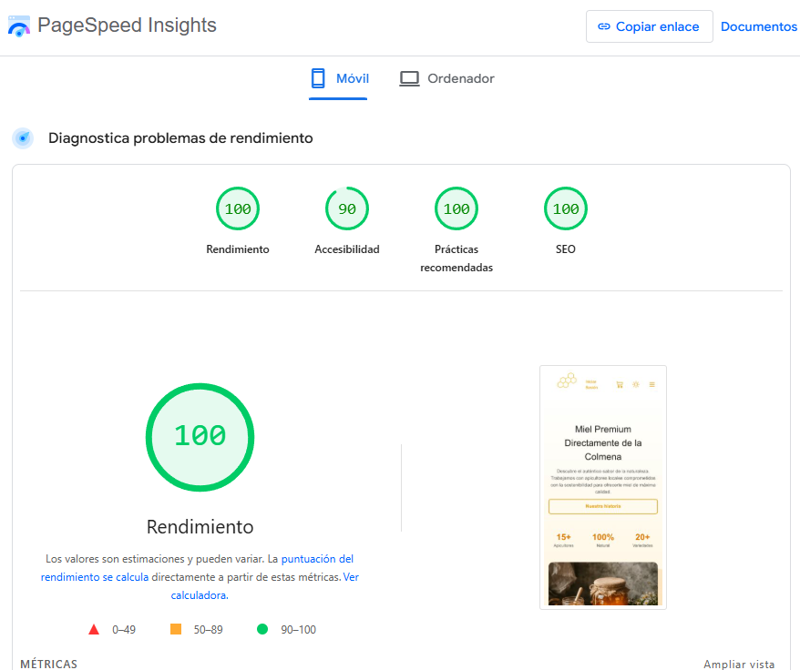
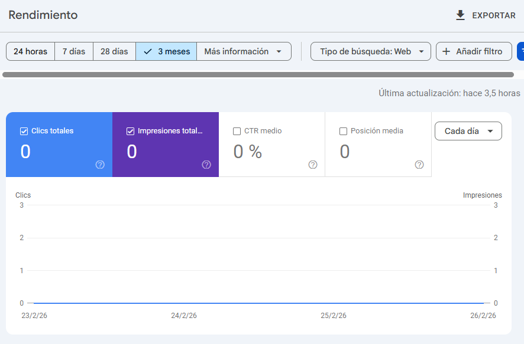
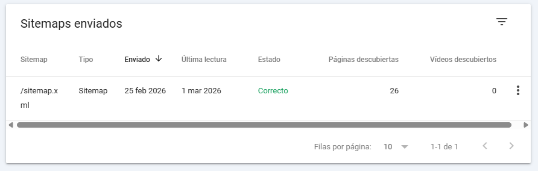

**Proyecto:** TheHive — Tienda online de productos de apicultura
**Módulo:** Proyecto Integrador — 2.º DAW
**Fecha:** Marzo 2026
**Desarrollador** Pablo Suárez Álvarez

---
## Introducción

TheHive es una tienda de comercio electrónico orientada a la venta de miel artesanal. La visibilidad del negocio depende de su presencia en motores de búsqueda, por lo que se ha diseñado una estrategia de **SEO** (_Search Engine Optimization_) que cubre aspectos técnicos y de contenido.

El objetivo es maximizar el posicionamiento orgánico, atrayendo tráfico cualificado sin recurrir a publicidad de pago mediante decisiones de diseño y desarrollo optimizadas.

---
## 1. Selección y asignación de palabras clave

Se han identificado los términos de búsqueda o **keywords** con un enfoque de **cola larga** (_long-tail keywords_): consultas específicas con menor competencia y mayor intención de compra.

### Distribución de keywords por sección

|**Página**|**Keyword principal**|**Propósito**|
|---|---|---|
|Inicio (`/`)|"tienda miel online España"|Tráfico general de marca|
|Catálogo (`/productos`)|"miel ecológica online"|Usuarios con intención de compra|
|Categoría (`/categoria/[slug]`)|"[tipo de miel] comprar"|Segmentación por producto|
|Producto (`/productos/[slug]`)|"[nombre del producto] precio"|Conversión directa a venta|
|Blog (`/blog`)|Variadas según artículo|Tráfico informacional|
|Sobre nosotros|"apicultores artesanales"|Autoridad y confianza|

---

## 2. SEO On-Page: optimización de página

### 2.1 Metaetiquetas: título y descripción

Gestionadas a través del componente `Layout.astro`. El `<title>` sigue el formato `[Keyword] | TheHive`, mientras que la descripción se limita a 160 caracteres.

Fragmento de código

```
---
// Ejemplo en productos.astro
import Layout from '../layouts/Layout.astro';
---
<Layout
  title="Miel Ecológica Online"
  description="Compra miel ecológica y artesanal directamente del apicultor. Envío a toda España."
>
```

### 2.2 Estructura y Semántica

**Jerarquía de encabezados:** Cada página cuenta con un único `<h1>` con la keyword principal. Los niveles `<h2>` y `<h3>` estructuran el contenido jerárquicamente.

**URLs semánticas:** Las URLs son legibles, descriptivas y en minúsculas, gestionando los `slugs` desde Strapi.

|**Patrón evitado**|**Patrón adoptado**|
|---|---|
|`/producto?id=47`|`/productos/miel-de-romero-500g`|
|`/cat/1/subcategoria`|`/categoria/mieles-monofloral`|

---

## 3. SEO Técnico

### 3.1 Sitemap y Robots

Se utiliza `@astrojs/sitemap` para generar automáticamente el archivo de indexación.

El archivo `robots.txt` excluye páginas privadas (perfil, carrito, checkout) para evitar que aparezcan en los resultados de búsqueda.

```
User-agent: *
Allow: /
Disallow: /perfil
Disallow: /carrito
Disallow: /checkout

Sitemap: https://thehive.es/sitemap-index.xml
```

### 3.2 Datos estructurados (Schema.org)

Implementación de **JSON-LD** en fichas de producto para habilitar _rich snippets_ (fragmentos enriquecidos) con precio y disponibilidad.

### 3.3 Rendimiento y Core Web Vitals

Google utiliza estas métricas como señales de posicionamiento:

|**Métrica**|**Descripción**|**Umbral óptimo**|
|---|---|---|
|**LCP**|Tiempo de carga del elemento principal|< 2,5 s|
|**INP**|Respuesta a la interacción|< 200 ms|
|**CLS**|Estabilidad visual (movimiento de elementos)|< 0,1|


Utilizando https://pagespeed.web.dev/ comprobamos el rendimiento de la página:


Enlace del análisis:
https://pagespeed.web.dev/analysis/https-thehive-pablosuarez-dev/9zyu7qi8hh?form_factor=mobile

---

## 4. Estrategia de contenido

**El blog como motor de tráfico:** Cada artículo publicado es una nueva URL indexable. Consultas informativas como "beneficios de la miel" sirven de puerta de entrada hacia el catálogo comercial.

- **Descripciones únicas:** No se reutiliza texto de proveedores para evitar penalizaciones por contenido duplicado.
- **Protocolo Open Graph:** Metaetiquetas configuradas en `Layout.astro` para controlar la previsualización en redes sociales.

---

## 5. Seguimiento y Herramientas

| **Herramienta**       | **Función**                                       |
| --------------------- | ------------------------------------------------- |
| Google Search Console | Monitorización de indexación y errores de rastreo |
| PageSpeed Insights    | Medición de Core Web Vitals                       |




Actualmente no existen datos de rendimiento de Google Search Console.

Se ha enviado con éxito el sitemap.xml para su indexación, aún no ha pasado una semana desde en envío del _sitemap_. Se recomienda entre 1 y dos semanas para comenzar a recibir métricas.



---
## 6. Estado de implementación

| **Elemento**                   | **Estado**    |
| ------------------------------ | ------------- |
| Títulos y descripciones únicos | Implementado  |
| Etiquetas Open Graph           | Implementado  |
| Sitemap XML enviado            | Implementado  |
| Archivo robots.txt configurado | Implementado  |
| Certificado SSL (HTTPS) activo | Implementado  |
| Rendimiento > 80 en PageSpeed  | Implementado  |
| Atributos ALT en imágenes      | Implementado  |
| Datos Schema.org en productos  | **Pendiente** |
| Google Business Profile        | **Pendiente** |

---
## Conclusión
La estrategia se basa en tres pilares: una infraestructura técnica sólida, contenido alineado con la intención del usuario y un plan editorial sostenido. Esto permite competir en buscadores reduciendo la dependencia de inversión publicitaria.